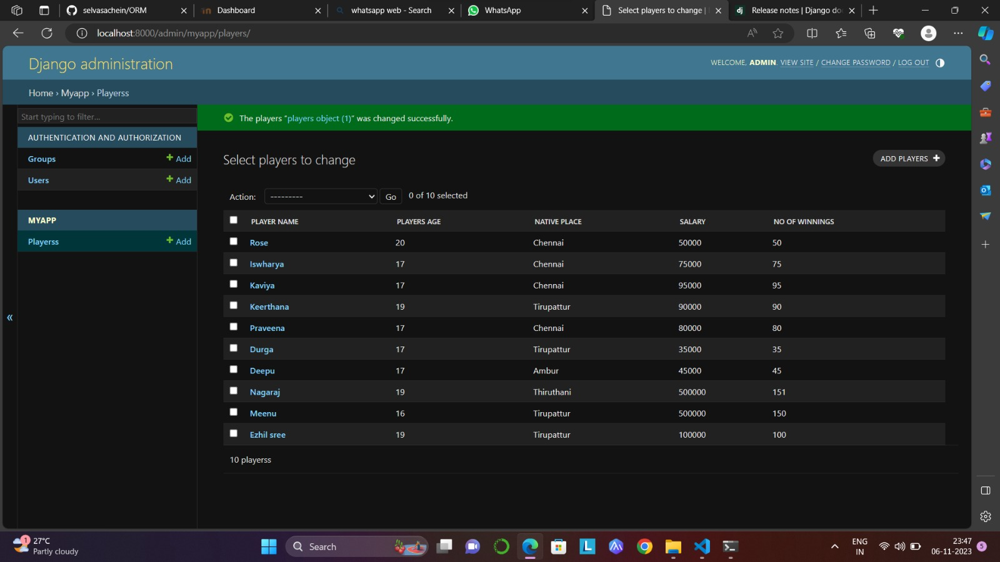

# Ex02 Django ORM Web Application
## Date:26.10.2023

## AIM
To develop a Django application to store and retrieve data from a Football Players database using Object Relational Mapping(ORM).

## DESIGN STEPS

### STEP 1:
Clone the problem from GitHub

### STEP 2:
Create a new app in Django project

### STEP 3:
Enter the code for admin.py and models.py

### STEP 4:
Execute Django admin and create 10 Football players

## PROGRAM
```py
models.py

from django.db import models
from django.contrib import admin
class players(models.Model):
    player_name=models.CharField(max_length=20)
    players_age=models.CharField(max_length=100)
    native_place=models.CharField(max_length=30)
    salary=models.IntegerField()
    no_of_winnings=models.IntegerField()

class playersAdmin(admin.ModelAdmin):
    list_display=('player_name','players_age','native_place','salary','no_of_winnings')


admin.py

from django.contrib import admin
from .models import players,playersAdmin
admin.site.register(players,playersAdmin)

```

## OUTPUT



## RESULT
Thus the program for creating a database using ORM hass been executed successfully
